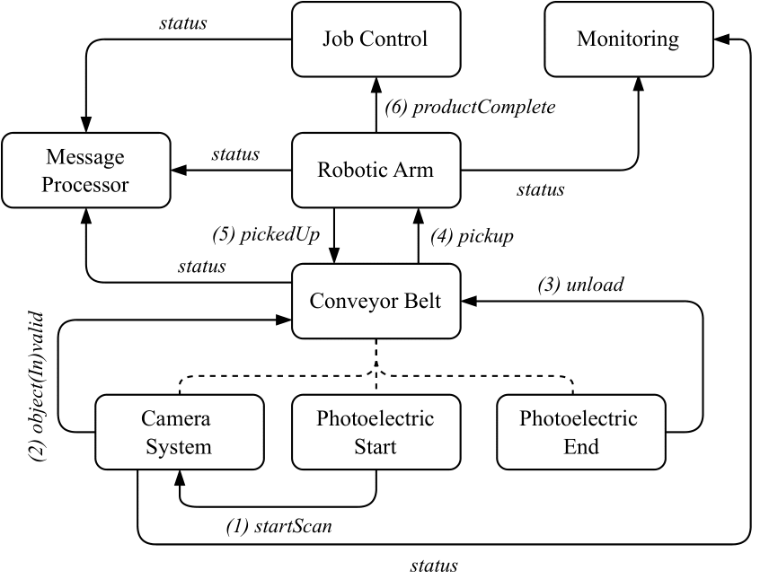

# Smart Factory Use Case

This directory contains the smart factory use case.
The use case is implemented twice based on two different ecosystems: 
[CSM / Cirrina](https://git.uibk.ac.at/informatik/dps/dps-dc-software/cirrina-project/cirrina) and
[Serverless Workflow](https://serverlessworkflow.io/) / [Sonataflow](https://sonataflow.org/serverlessworkflow/latest/index.html).

## Contents

- `csml`: Contains the CSM description files, describing the Cirrina smart factory use case. Also contains a basic 
  service implementations JSON file and instructions on how to run the Cirrina version of the use case.
- `experiment`: Contains [Ansible](https://www.ansible.com/) playbooks used to configure nodes for the smart factory 
  use case on the [Grid`5000](https://www.grid5000.fr/w/Grid5000:Home) testbed. Contains different playbooks for both
  the Cirrina and Sonataflow versions of the smart factory use case. Also contains Python scripts to conveniently
  generate Ansible inventories and Cirrina job files, create/delete [ZooKeeper](https://zookeeper.apache.org/) nodes,
  which are used by Cirrina, as well as a script to run all workflows of the Sonataflow version. Detailed setup
  instructions can be found in the [railway experiment README](../railway/experiment/README.md).
- `simulation-server`: Contains the HTTP server application used by both the Cirrina and Sonataflow
  versions of the smart factory use case. Has endpoints for all required service types (IoT, Edge and Cloud) which
  simulate appropriate responses.
- `swf-smart-factory`: Contains the Sonataflow version of the smart factory use case, a 
  [Quarkus](https://quarkus.io/)-based Java application. Also contains instructions on how to run the Sonataflow version 
  of the use case.

## Use Case Description

The smart factory use case includes conveyor belts, robotic arms, and camera systems within the Edge-IoT domain, and 
monitoring and assembly management in the Cloud domain to fully model a simulated production line.

One of the main components of the use case is a conveyor belt which includes the nested state machines camera system
and two photoelectric sensors (One at the start of the belt and one at the end of the belt). The photoelectric sensors
are responsible for detecting objects on the belt, while the camera sensor checks the objects for validity.

Additionally, a robotic arm interacts closely with the conveyor belt to pick up objects from the belt and assemble
them to a final product.

A job control state machine is responsible for controlling the production process and stopping the production after
a specified amount of products is completed. A monitoring state machine monitors the progress of the job and multiple
message processors handle status messages and errors in different ways (e.g. by using logging, SMS or email).

The following diagram shows the state machines used within the smart factory CSM:

The overall production process goes through the following steps:

1. A photoelectric sensor at the start of the belt checks for an object, repeating after a short timeout if none is 
   found. If an object is detected, the camera system is signaled (`startScan`).
2. The camera system takes a photo and scans the object on the belt for validity;
   1. If invalid (`objectInvalid`): A status message is logged, an alarm notification is sent, manual interaction is 
      required, and the sensor repeats detection;
   2. If valid (`objectValid`): The conveyor belt is signaled to start moving the object towards the end;
3. A photoelectric sensor at the end of the belt checks for an object, repeating after a short timeout if none is found.
   If an object is detected at the end, the conveyor belt is signaled to stop movement (`unload`).
4. The conveyor belt then signals the robotic arm to pick up the current object (`pickup`). The robotic arm assembles 
   the object into the final product and returns to its starting position;
   1. Pickup or assembly failures are logged, an alarm notification is sent, and the robotic arm retries the pickup if 
      needed;
   2. An internal counter tracks assembled parts. Upon reaching the specified number per product, it resets, and the 
      job control system is signaled (`productComplete`);
5. After the robotic arm successfully picks up the object, the conveyor belt is signaled to cycle and process the next 
   object (`pickedUp`);
6. The job control system increases its counter upon product completion. When the total number of products is reached, 
   it enters a terminal state and signals all other state machines to terminate, completing the production process;

Throughout the production process, various additional `status` messages are sent for monitoring purposes and to inform 
about a started/completed job.

The Serverless Workflow version of the use case follows a similar approach, where each state machine is translated to
a respective workflow. We skipped the monitoring system and message processors and replaced corresponding events with 
async service invocations if possible. This was necessary in order to take into account the lower event rate that is 
possible with Sonataflow and to ensure that all required logs are correctly produced.
