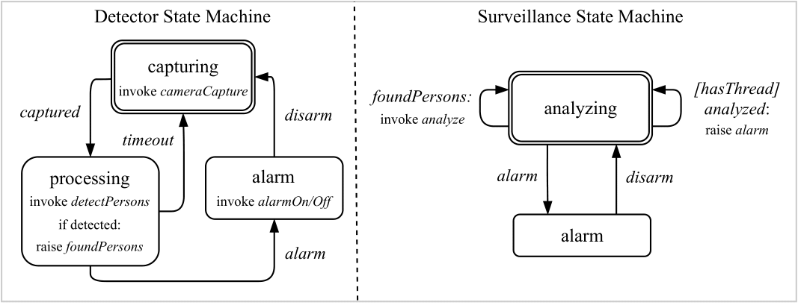

# Video Surveillance Use Case

This directory contains the video surveillance use case.
The use case is implemented twice based on two different ecosystems:
[CSM / Cirrina](https://git.uibk.ac.at/informatik/dps/dps-dc-software/cirrina-project/cirrina) and
[Serverless Workflow](https://serverlessworkflow.io/) / [Sonataflow](https://sonataflow.org/serverlessworkflow/latest/index.html).

## Contents

- `csml`: Contains the CSM description files, describing the Cirrina video surveillance use case. Also contains a basic
  service implementations JSON file and instructions on how to run the Cirrina version of the use case.
- `experiment`: Contains [Ansible](https://www.ansible.com/) playbooks used to configure nodes for the video surveillance
  use case on the [Grid`5000](https://www.grid5000.fr/w/Grid5000:Home) testbed. Contains different playbooks for both
  the Cirrina and Sonataflow versions of the video surveillance use case. Also contains python scripts to conveniently
  generate Ansible inventories and Cirrina job files, create/delete [ZooKeeper](https://zookeeper.apache.org/) nodes,
  which are used by Cirrina, as well as a script to run all workflows of the Sonataflow version. Detailed setup
  instructions can be found in the [railway experiment README](../railway/experiment/README.md).
- `scripts`: Contains all three service applications (IoT, Edge and Cloud) used by the video surveillance use case. Also
  contains a Python script which can be used to compare log files produced by the services to calculate the processing
  time per processed image.
- `swf-surveillance-system`: Contains the Sonataflow version of the video surveillance use case, a
  [Quarkus](https://quarkus.io/)-based Java application. Also contains instructions on how to run the Sonataflow version of the use
  case.

## Use Case Description

The video surveillance system continuously monitors video footage from cameras and triggers an alarm if unknown persons
are detected.

The surveillance system includes the following layers:

- IoT layer with cameras and alarms, capturing images for processing at the Edge layer and triggering an alarm if a
  threat (unknown person) was detected.
- Edge layer, where images are pre-processed to filter out irrelevant images that do not contain persons, preventing
  unnecessary computationally expensive analysis on the cloud layer.
- Cloud layer, which involves face analysis to detect unknown persons. If an unknown person is detected, an alarm is
  triggered on the IoT layer.

The following diagram shows the state machines used within the surveillance system CSM:

In this implementation, the process of detecting a threat goes through the following steps:

1. in the capturing state, an image is captured from an IoT device (`invoke cameraCapture`). The default image capture
   rate is set at 500 milliseconds;
2. in the processing state, lightweight pre-processing (person detection) occurs, filtering out images which do not
   contain persons (`invoke detectPersons`);
3. iff persons are detected (`foundPersons` event), Cloud analysis is initiated in the analyzing state
   (`invoke analyze`);
4. upon detecting a threat (unknown person), a global alarm is triggered (`alarm` event);
5. if no persons are detected, the Detector state machine times out in the processing state and initiates a new capture;
6. an alarm can be disarmed via the `disarm` event. This event is triggered after a specified timeout (by default,
   10 seconds).

The Serverless Workflow version of the use case follows a similar approach, where each state machine is translated to
a respective workflow. An additional workflow to handle the alarm was deployed, to ensure that the alarm is not directly
triggered on the cloud layer.
